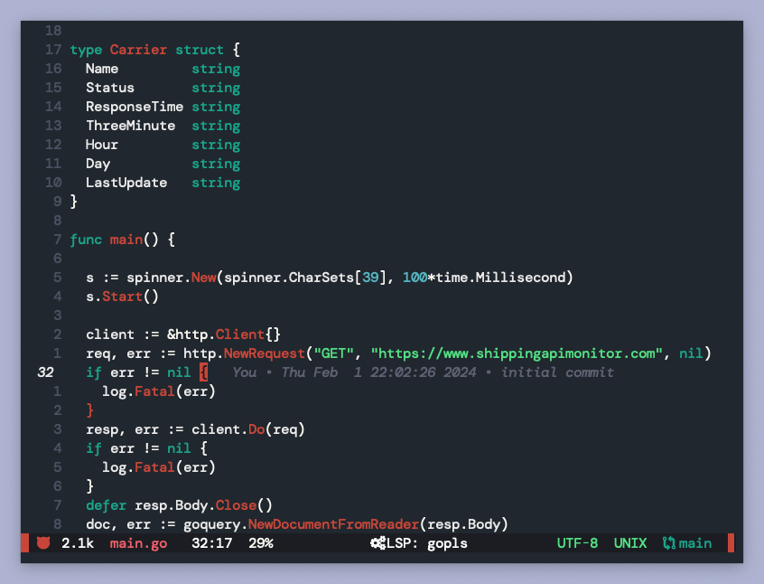

# henna.nvim

henna.nvim is a port of the doom-henna theme for doomemacs, which itself is based on the Henna VSCode theme. It is a work in progress.

originally forked from the incredible [oh-lucy](https://github.com/Yazeed1s/oh-lucy.nvim) by Yazeed1s.
